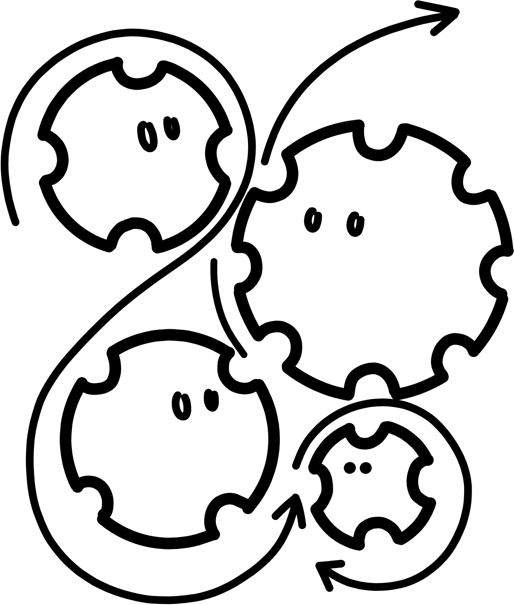
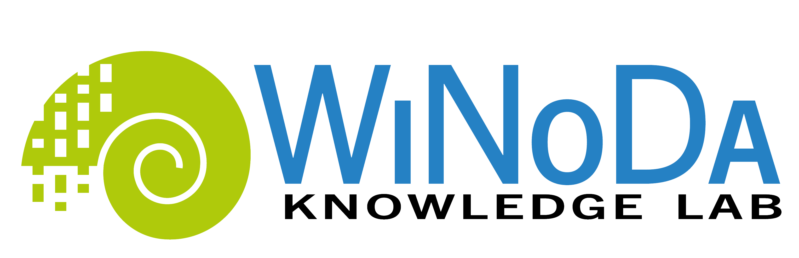
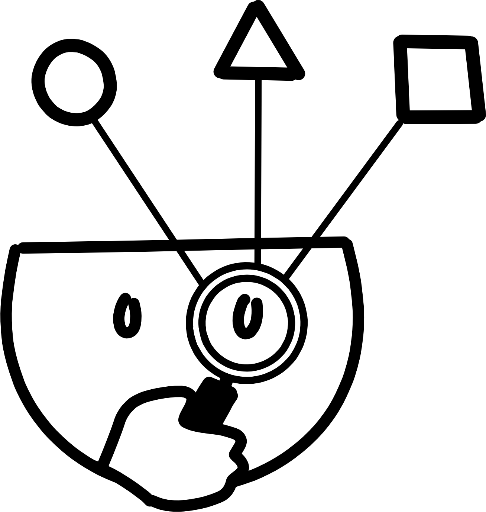
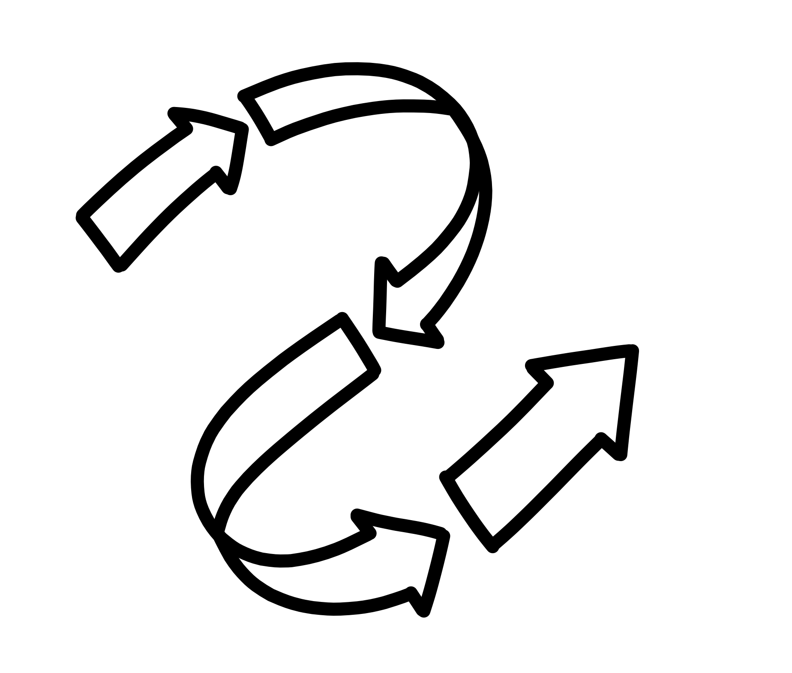

<!--
author: WiNoDa Knowledge Lab
email: winoda@gfbio.org
version: 1.0.0
language: eng
comment: Open-Science-Selbstlernkurs für objektzentrierter Forschung in LiaScript.
tags: Open Science, WiNoDa, FAIR, CARE, Open Data, Open Access, OER, LiaScript
license: CC BY 4.0

@OS: <div class="thread os-thread"><strong>Open Science Compass:</strong> @0</div>
@WiNoDa: <div class="thread winoda-thread"><strong>WiNoDa Practical Pathway:</strong> @0</div>
@Reflection: <div class="thread reflection-thread"><strong>Reflection:</strong> @0</div>
@Check: <div class="thread check-thread"><strong>Checkliste:</strong> @0</div>

@style
.thread {
  border-left: 0.35rem solid #444;
  margin: 1rem 0;
  padding: 0.75rem 1rem;
  background: #f7f8fa;
}
.os-thread {
  border-left-color: #1f6feb;
}
.winoda-thread {
  border-left-color: #1b7f4c;
}
.reflection-thread {
  border-left-color: #a15c00;
}
.check-thread {
  border-left-color: #7d4cc2;
}
.small {
  font-size: 0.92rem;
}
.source-note {
  font-size: 0.88rem;
  color: #555;
}
@end
-->

# Open Science in object-related research

Open Science self-paced LiaScript course for researchers working with object-related research data

@OS(`This course approaches Open Science as a movement, a system of values, and a set of concrete open research practices.`)

@WiNoDa(`The second pathway translates each Open Science topic into the context of natural science collections, object-related data, and the disciplinary fields represented within WiNoDa Knowledge Lab.`)

This course is aimed at researchers at doctoral level or above who work with object-related data in archaeology, biodiversity research, palaeontology, geology or related disciplines. It is a stand-alone course that you can complete at your own pace and for which no participation in other learning activities or course modules is required.

The course has been designed as a LiaScript-first open educational resource. Its source file is written in readable Markdown and can be used as an interactive course in a LiaScript viewer.

**Estimated completion time::** approx. 2–3 hours

**Course output:** By the end of the course, you will have developed a concise Open Science action plan for your own object-related research project or for an illustrative example project.

## How to use this course

1. Work through the modules in the suggested order.
2. Use the self-checks to assess your understanding.
3. For each reflection activity, briefly record your responses and key takeaways in a separate document.
4. At the end of the course, bring these notes together to create an action plan for your own research.

> Important: This course does not constitute legal advice and is not a substitute for guidance from your institution’s Open Science, research data management, ethics, or legal support services. It is designed to help you identify the right questions and prepare informed decisions.

<!-- style="display: block; width: 30%; max-width: 220px; margin: 5rem auto 0 auto;" -->

## Two guiding pathways

| Pathway | Key question | Typical artefacts |
| --- | --- | --- |
| Open Science compass | What does Open Science mean in general, and how is it put into practice? | Policies, repositories, open licences, documentation, FAIR/CARE principles, Open Access |
| WiNoDa practice pathway | What changes when research depends on collection objects, samples, specimens, or excavation contexts? | PIDs for physical objects, Open Specimen, Open Collections, site protection, provenance, Nagoya Protocol, disciplinary repositories |

<!-- style="display: block; width: 40%; max-width: 220px; margin: 6rem auto 0 auto;" -->

## Prior knowledge survey

Assess your current level of confidence. This survey is not graded.

<!-- style="direction: rtl; text-align: left" -->
- [(very high 5)(high 4)(moderate 3)(fairly low 2)(low 1)]
- [ ] I can explain Open Science in my own words
- [ ] I can distinguish between FAIR and Open
- [ ] I can select an appropriate repository for research data
- [ ] I can identify limits to openness when working with sensitive data, objects, or contexts

<!-- style="display: block; width: 25%; max-width: 220px; margin: 2rem auto 0 auto;" -->

## Course learning objectives

After completing this course, you will be able to:

- explain key principles, aims, and dimensions of Open Science
- situate Open Science practices within the research lifecycle
- explain the relationship between FAIR, CARE, and Open
- assess the role of open infrastructures, repositories, PIDs, and licences as prerequisites for reuse
- identify the specific requirements of object-related and collection-based research
- outline a well-founded Open Science strategy for your own research project or an illustrative example project

<!-- style="display: block; width: 30%; max-width: 220px; margin: 6rem auto 0 auto;" -->

## The Open Science action plan

Use this template throughout the course and complete it step by step.

| Decision | Your notes |
| --- | --- |
| Which research objects, samples, specimens, or contexts are central to the project? | |
| Which data, methods, software, and publications will be produced? | |
| What can be made openly available, what should be accessible under FAIR conditions, and what must remain closed? | |
| Which PIDs, metadata standards, vocabularies, and repositories are appropriate? | |
| Which licences and terms of use are suitable? | |
| Which ELSA, CARE, provenance, or Nagoya-related questions need to be addressed? | |
| Who can provide institutional or disciplinary support? | |

<!-- style="display: block; width: 30%; max-width: 220px; margin: 5rem auto 0 auto;" -->

---

## Module 1: Open Science basics

<!-- style="display: block; width: 30%; max-width: 220px; margin: 7rem auto 0 auto;" -->

### Learning objectives

After completing this module, you will be able to:

- describe Open Science as a global movement and as a set of open research practices
- explain the key aims of the UNESCO Recommendation on Open Science and the DFG’s position on Open Science
- identify key dimensions of Open Science
- explain why open infrastructures are essential for Open Science
- outline the relevance of Open Science for the WiNoDa Knowledge Lab and object-related research

<!-- style="display: block; width: 30%; max-width: 220px; margin: 5rem auto 0 auto;" -->

### Check-in

Which statement best reflects how Open Science is understood in this course?

- [( )] Open Science means solely making published articles freely available.
- [( )] Open Science means publishing all data without restrictions.
- [(X)] Open Science combines open accessibility, reusability, transparency, collaboration, and careful consideration of the limits to openness.
- [( )] Open Science is merely a technical issue concerning databases.

<!-- style="display: block; width: 40%; max-width: 220px; margin: 5rem auto 0 auto;" -->

### Open Science as a movement and a set of practices

Open Science has two closely connected dimensions:

1. **A global movement:** Research should become more accessible, transparent, collaborative, and responsive to society.
2. **Practices in everyday research:** Data, methods, software, publications, educational resources, and infrastructures are designed to be findable, accessible, interoperable, reusable, and transparent.

@OS(`Open Science is not an all-or-nothing principle. Instead, it follows the maxim: “As open as possible, as closed as necessary.” Good practice in Open Science means designing openness deliberately and documenting its limits with clear justification.`)

The [UNESCO Recommendation on Open Science](https://www.unesco.org/en/open-science/about) (2021) describes Open Science as an inclusive concept that brings together different movements and open research practices.

Its aims are to make scientific knowledge available, accessible, and reusable, to strengthen collaboration and the exchange of information, and to open knowledge-production processes to societal actors.

The German Research Foundation (DFG) further emphasises that Open Science should enable and improve research. Openness is therefore not an end in itself. It should support access, reproducibility, scientific progress, and research processes that are appropriate to the respective discipline.

<!--style="display: block; width: 40%; max-width: 220px; margin: 1rem auto 0 auto;" -->

### Dimensions of Open Science

| Dimension | Brief description | Example |
| --- | --- | --- |
| Open Access | Free access to and legally secured reuse of scholarly publications | Article published in an Open Access journal or made available through secondary publication |
| Open Data | Research data that are openly published or made available under controlled access conditions | Dataset with a DOI deposited in a repository |
| Open Source / Open Software | Source code is accessible, reviewable, reusable, and open to further development | Analysis code released under an MIT, GPL, or Apache licence |
| Open Methodologies | Methods, protocols, workflows, and decisions are documented in a transparent and reproducible way | Preregistration, research protocol, or electronic lab notebook |
| Open Educational Resources | Teaching and learning materials that can be freely used, adapted, and shared | This LiaScript course licensed under CC BY 4.0 |
| Open Peer Review | Transparent forms of scholarly review | Open review reports, open reviewer identities, or open participation |
| Citizen Science / Public Engagement | Participation of societal actors in research | Collection-based projects, data collection, or co-creation |

### What is the WiNoDa Knowledge Lab?

The project partners are:

- [Museum für Naturkunde Berlin (MfN)](https://www.museumfuernaturkunde.berlin/en/)
- [Deutsche Archäologische Institut (DAI)](https://www.dainst.org/en/)
- [German Federation for Biological Data (GFBio)](https://www.gfbio.org)
- [Vernetzungs- und Kompetenzstelle Open Access Brandenburg (VuK)](https://open-access-brandenburg.de/en/)
- [Gemeinsame Bibliotheksverbund (GBV)](https://en.gbv.de)
- [Zuse-Institut Berlin (ZIB)](https://www.zib.de)

WiNoDa brings together data literacy, research data management, Open Science, and public engagement. This course focuses on the Open Science perspective.
WiNoDa addresses a range of target groups, including researchers, people interested in data, collection curators, and experienced researchers.

@WiNoDa(Object-related research has a distinctive feature. Data are often derived from physical objects, samples, specimens, or excavation contexts. Open Science must therefore consider data, objects, collections, and their provenance together.)

<!-- style="display: block; width: 60%; max-width: 1200px; height: auto; margin: 7rem auto 0 auto;" -->

### Open Infrastructures

Open Science requires (open) infrastructure. This includes digital and physical systems, as well as norms, standards, governance, and sustainable maintenance.

| Infrastructure | Function in the course context |
| --- | --- |
| Repositories | Publication, archiving, and citability of data, code, preprints, or materials |
| PID systems | Unique and persistent identification of people, institutions, datasets, and objects |
| Metadata schemas | Description, discoverability, and interoperability |
| Collaboration platforms | Transparent collaboration and version control |
| Open-source tools | Reproducible processing, analysis, and documentation |
| Physical collections | Preservation, curation, and access to research objects |

<!-- style="display: block; width: 40%; max-width: 450px; height: auto; margin: 3rem auto 0 auto;" -->

### Self-check

Which elements are part of Open Science?

[[X]] Open Research Data
[[X]] Open Educational Resources
[[X]] Open Software and Source Code
[[ ]] Exclusively fee-based closed-source analysis platforms
[[X]] Open Infrastructures

<div style="height: 2.5rem;"></div>

What is a meaningful function of Open Science policies?

[( )] They completely replace disciplinary research practices.
[(X)] They provide guidance, establish support structures, and promote cultural change.
[( )] They always require the publication of all raw data.
[( )] They are only relevant to libraries.

<!-- style="display: block; width: 35%; max-width: 450px; height: auto; margin: 3rem auto 0 auto;" -->

<div style="height: 2.5rem;"></div>

@Reflection(`Write down two Open Science practices that are already part of your everyday research. Also write down one practice that you would like to implement more systematically.`)

<div style="height: 3rem;"></div>

### Key Takeaway

Open Science is both a framework of values and a framework for practice. For WiNoDa, it is important that openness does not apply only to publications or datasets, but to the entire research cycle and the material foundations of object-related research.

<!-- style="display: block; width: 40%; max-width: 450px; height: auto; margin: 3rem auto 3rem auto;" -->

### Sources for Module 1

- UNESCO. (2021). *UNESCO recommendation on Open Science*. https://doi.org/10.54677/MNMH8546

- Deutsche Forschungsgemeinschaft. (2022). *Open Science as part of research culture: Positioning of the German Research Foundation*. https://doi.org/10.5281/zenodo.7194537

- Fecher, B., & Friesike, S. (2014). Open Science: One term, five schools of thought. In S. Bartling & S. Friesike (Eds.), *Opening science: The evolving guide on how the Internet is changing research, collaboration and scholarly publishing* (pp. 17–47). Springer. https://doi.org/10.1007/978-3-319-00026-8_2

#### Internal materials

*KernkursOpenScience_Modulplanung_v3.docx*. (n.d.). [Unpublished internal course-planning document].

*Quo_Vadis_WiNoDa_11_02_25.pdf*. (n.d.). [Unpublished internal project document].

*Praesentation_v6_2025-05-13.pdf*. (2025). [Unpublished internal presentation].

*WinterSchool_Presentation_v3.pdf*. (n.d.). [Unpublished internal presentation].
---

## Modul 2: Open Science beim Forschen

### Lernziele

Nach diesem Modul kannst du:

- Open-Science-Praktiken im Forschungszyklus verorten
- Dokumentation, Präregistrierung und Open Methodologies erläutern
- offene Formate und Open-Source-Software als Bausteine von Nachnutzung einordnen
- Linked Open Data und das 5-Sterne-Modell für offene Daten erklären
- Besonderheiten von Open Specimen und Open Collections in objektbezogener Forschung benennen

### Aktivierung

Wann beginnt Open Science in einem Forschungsprojekt?

[( )] Erst nach der Annahme des Artikels.
[( )] Erst, wenn ein Repositorium ausgewählt wurde.
[(X)] Schon in der Planungsphase, weil Dokumentation, Rechte, Formate, Objekte und Repositorien früh entschieden werden.
[( )] Nur bei der Öffentlichkeitsarbeit.

### Open Science im Forschungszyklus

```ascii
              +----------------+
              |  Planen        |
              |  Fragen, DMP,  |
              |  Rechte, CARE  |
              +-------+--------+
                      |
                      v
+-------------+   +---+----------+   +----------------+
| Nachnutzen  |<--| Erheben      |-->| Aufbereiten    |
| zitieren,   |   | dokumentieren|   | bereinigen,    |
| bewerten    |   | Versionen    |   | validieren     |
+------+------+   +---+----------+   +--------+-------+
       ^              |                       |
       |              v                       v
+------+-------+  +---+----------+   +--------+-------+
| Publizieren  |<-| Analysieren  |<--| Beschreiben    |
| Daten, Code, |  | Code, Tools, |   | Metadaten, PID |
| Artikel      |  | Workflows    |   | Lizenzen       |
+--------------+  +--------------+   +----------------+
```

@OS(`Der Forschungszyklus zeigt: Offenheit ist nicht der letzte Schritt. Entscheidungen zu Dokumentation, Formaten, Rechten und Infrastruktur wirken von Anfang an.`)

### Dokumentation als Kernpraxis

Ohne nachvollziehbare Dokumentation sind Wiederverwendung und Reproduktion kaum möglich. Dokumentation umfasst mehr als einen Methodenabschnitt im Artikel:

- Erhebungskontext und Auswahlentscheidungen
- verwendete Objekte, Samples, Specimens oder Fundkontexte
- Instrumente, Software, Versionen und Parameter
- Datenbereinigung und Ausschlussentscheidungen
- Ordnerstruktur, Dateiformate, Variablen und Einheiten
- Rechte, Lizenzen, Zugangsbeschränkungen und Provenienz
- Abweichungen vom ursprünglichen Plan

@WiNoDa(`Bei objektbezogener Forschung muss die Dokumentation die Beziehung zwischen physischem Objekt und abgeleiteten Daten tragen. Ohne stabile Objektidentifikation verliert ein Datensatz viel Nachnutzungspotenzial.`)

### Open Methodologies und Präregistrierung

Open Methodologies meint Praktiken, die den Forschungsprozess transparent machen. Dazu zählen:

- Präregistrierung von Forschungsfragen, Hypothesen, Methoden oder Analyseplänen
- offene Protokolle und Workflows
- Versionierung von Code, Datenaufbereitung und Dokumentation
- Veröffentlichung von Methoden, Skripten und Zwischenergebnissen, wenn sinnvoll
- offene Formate und Standards

Präregistrierung ist nicht nur für klassische hypothesentestende Studien relevant. In Archäologie, Paläontologie, Biodiversitätsforschung oder Geologie kann sie helfen, Projektplanung, Erhebungslogik und spätere Abweichungen transparent zu machen. Gerade bei Grabungen oder invasiven Untersuchungen an Objekten ist Planung zentral, weil Erhebungen nicht immer wiederholbar sind.

### Offene Formate

Offene Formate sind dokumentiert, standardisiert und nicht an einen bestimmten Hersteller gebunden. Sie verringern Abhängigkeiten und erhöhen langfristige Nutzbarkeit.

| Datentyp | Häufig offene oder gut archivierbare Formate | Vorsicht bei |
| --- | --- | --- |
| Tabellen | CSV, TSV, ODS | proprietären Tabellen mit versteckten Formeln |
| Text | TXT, Markdown, XML, PDF/A | unstrukturierten Scans ohne OCR |
| Bilder | TIFF, PNG, JPEG2000 | nur komprimierten Arbeitskopien |
| Geodaten | GeoJSON, GeoPackage, GeoTIFF, Shapefile mit Dokumentation | unvollständigen Projektdaten aus Desktop-GIS |
| 3D / Modelle | OBJ, PLY, STL, glTF je nach Zweck | nicht dokumentierten Spezialformaten |
| Code | plain text, Skripte, Container-/Environment-Dateien | nur grafischen Workflows ohne Export |

### Open Source Software

Open Source Software bedeutet, dass Quellcode offen verfügbar ist und unter einer Softwarelizenz genutzt, geprüft, verändert und weitergegeben werden kann. Für Forschungssoftware sind Creative-Commons-Lizenzen meistens nicht geeignet; übliche Softwarelizenzen sind zum Beispiel MIT, GPL, LGPL, Apache, BSD, MPL oder EPL.

Open Source unterstützt:

- Nachvollziehbarkeit von Analysewegen
- Reproduzierbarkeit von Ergebnissen
- Weiterentwicklung durch Communities
- Datensouveränität und geringeren Vendor-Lock-in
- langfristigere Verfügbarkeit wissenschaftlicher Workflows

### Linked Open Data und Interoperabilität

Interoperabilität bedeutet, dass Daten zwischen Systemen ausgetauscht, interpretiert und kombiniert werden können. Dafür braucht es maschinenlesbare Daten, Metadaten, PIDs, Vokabulare, Ontologien und standardisierte Beziehungen.

Das 5-Sterne-Modell für offene Daten ist eine Orientierung:

| Stufe | Anforderung | Beispiel |
| --- | --- | --- |
| 1 Stern | im Web verfügbar und offen lizenziert | PDF oder Bilddatei |
| 2 Sterne | maschinenlesbar und strukturiert | Tabellenformat |
| 3 Sterne | nicht-proprietäres Format | CSV statt XLSX |
| 4 Sterne | offene W3C-Standards wie RDF und SPARQL | RDF-Graph |
| 5 Sterne | mit anderen Daten verlinkt | Linked Open Data |

@Check(`Mehr Sterne bedeuten nicht automatisch bessere Forschung. Sie bedeuten oft auch mehr Aufwand. Entscheidend ist, welche Nachnutzung realistisch und fachlich sinnvoll ist.`)

### Open Specimen und Open Collections

In sammlungsbasierter Forschung sind physische Objekte nicht nur Material, sondern primäre Forschungsgrundlage. Aus ihnen abgeleitete Daten können nie alle Eigenschaften des Objekts ersetzen.

Wichtige Prinzipien:

- Objekte, Samples oder Specimens sollen möglichst auffindbar und langfristig zugänglich sein.
- PIDs wie IGSN, CETAF Stable Identifiers oder NSId können physische Objekte referenzieren.
- Mindestens sollten stabile Katalognummern und Sammlungsinformationen vorhanden sein.
- Sammlungen brauchen Inventarisierung, Katalogisierung, Digitalisierung, Kuratierung und nachhaltige Governance.
- Open Collections meint nicht, dass jedes Objekt physisch frei verfügbar ist, sondern dass Informationen und Zugangswege transparent und FAIR gestaltet sind.

### Selbstcheck

Welche Aussage zu Dokumentation ist richtig?

[( )] Dokumentation ist erst nach der Veröffentlichung relevant.
[(X)] Dokumentation ermöglicht Nachvollziehbarkeit, Wiederverwendung und Bewertung von Forschungsergebnissen.
[( )] Dokumentation ersetzt Metadaten vollständig.
[( )] Dokumentation betrifft nur Textdaten.

Welche PID passt am besten?

Veröffentlichter Datensatz: [[(DOI)|ORCID|ROR|IGSN/CSI/NSId]]

Forschende Person: [[DOI|(ORCID)|ROR|IGSN/CSI/NSId]]

Forschungseinrichtung: [[DOI|ORCID|(ROR)|IGSN/CSI/NSId]]

Physisches Sample oder Specimen: [[DOI|ORCID|ROR|(IGSN/CSI/NSId)]]

Welche Schritte erhöhen Interoperabilität?

[[X]] Nutzung kontrollierter Vokabulare
[[X]] Verwendung stabiler PIDs
[[X]] strukturierte Metadaten
[[ ]] Daten nur als Screenshot bereitstellen
[[X]] offene und dokumentierte Dateiformate

### Reflexion

@Reflexion(`Wähle einen Datentyp aus deiner Forschung. Notiere, welches offene Format, welche Dokumentation, welche PID und welches Repositorium dafür infrage kommen könnten.`)

### Kurzfazit

Open Science beim Forschen bedeutet, den Forschungsprozess so zu gestalten, dass andere Menschen und Maschinen verstehen können, wie Daten, Methoden und Ergebnisse entstanden sind. In objektbezogener Forschung muss zusätzlich die Beziehung zwischen Daten, Objekten, Sammlung und Provenienz stabil bleiben.

### Quellen Modul 2

- GO FAIR. FAIR Principles. https://www.go-fair.org/fair-principles/
- Tim Berners-Lee. Linked Data. https://www.w3.org/DesignIssues/LinkedData.html
- Open Source Initiative. Licenses. https://opensource.org/licenses
- Colella et al. The Open-Specimen Movement. https://doi.org/10.1093/biosci/biaa146
- Ross & Ballsun-Stanton. Introducing Preregistration of Research Design to Archaeology. https://doi.org/10.31235/osf.io/sbwcq
- Tennant & Farke. Open Science in Dinosaur Paleontology. https://doi.org/10.31233/osf.io/wzfpb
- Lokale Materialien: `KernkursOpenScience_Modulplanung_v3.docx`, `Praesentation_v6_2025-05-13.pdf`, `Presentation_Webinar_Be-Fair-and-Care_2025-05-20.pdf`, `WinterSchool_Presentation_v3.pdf`

---

## Modul 3: Open Science beim Publizieren

### Lernziele

Nach diesem Modul kannst du:

- Formen der Datenpublikation unterscheiden
- Kriterien für die Wahl eines Repositoriums anwenden
- Open Access, Lizenzen und Data/Code Availability Statements erklären
- Zweck und Aufbau von Datenartikeln beschreiben
- Open Peer Review und seine Chancen und Grenzen einordnen

### Aktivierung

Was ist ein häufiger Nachteil, wenn Forschungsdaten nur als Supplement zu einem Artikel veröffentlicht werden?

[( )] Supplements sind immer offener als Repositorien.
[(X)] Der Datensatz erhält oft keine eigene PID und ist schwerer eigenständig zitierbar.
[( )] Supplements müssen immer unter CC0 stehen.
[( )] Supplements enthalten automatisch alle Rohdaten.

### Drei Wege der Datenpublikation

| Form | Nutzen | Grenzen |
| --- | --- | --- |
| Repositorium | eigene DOI/PID, Metadaten, Lizenz, nachhaltigere Auffindbarkeit | Auswahl und Datenaufbereitung brauchen Zeit |
| Data Journal | Datensatz wird kontextualisiert und peer-reviewed beschrieben | Daten liegen meist zusätzlich in einem Repositorium |
| Supplement zum Artikel | erfüllt oft Journalanforderungen und verbindet Daten mit Artikel | häufig begrenzte Rohdaten, schwächere Zitierbarkeit, weniger Nachnutzung |

@OS(`Eine gute Datenpublikation macht Daten nicht nur sichtbar, sondern zitierbar, rechtlich nachnutzbar und fachlich interpretierbar.`)

### Repositorien auswählen

Ein gutes Repositorium passt zu Fach, Datentyp, Zugangsbedarf und Langzeitperspektive.

Kriterien:

- fachlich oder thematisch passend
- akzeptiert den Datentyp und die Dateigrößen
- vergibt PIDs, idealerweise DOI oder fachlich passende PIDs
- erlaubt Lizenzen und klare Nutzungsbedingungen
- unterstützt Embargo oder eingeschränkten Zugang, wenn nötig
- bietet Qualitätskontrolle oder Datenkuration
- ist transparent betrieben und langfristig angelegt
- ist zertifiziert oder erfüllt anerkannte Standards, wenn möglich

Momentaufnahme: re3data.org verzeichnete am 24.06.2026 **3505 Repositories**. Der Dienst empfiehlt die Zitierung als: re3data.org - Registry of Research Data Repositories, DOI: [10.17616/R3D](https://doi.org/10.17616/R3D), last accessed: 2026-06-24.

@Check(`Suche zuerst fachlich passende Repositorien. Wenn es kein gutes Fachrepositorium gibt, pruefe institutionelle oder generische Angebote wie Zenodo, OSF oder Figshare.`)

### Repositorien im WiNoDa-Kontext

| Kontext | Mögliche Startpunkte |
| --- | --- |
| Erd- und Umweltwissenschaften | PANGAEA, fachspezifische Repositorien in re3data |
| Biodiversität | GFBio, GBIF-nahe Datenpublikation, Fachrepositorien |
| Archäologie | IANUS, Journal of Open Archaeology Data, Internet Archaeology, Fachrepositorien |
| fachübergreifende Daten | Zenodo, OSF, Figshare oder institutionelle Repositorien |
| Code | GitHub/GitLab plus Archivierung und DOI z. B. über Zenodo |

### Datenartikel

Datenartikel interpretieren Daten nicht wie ein Forschungsartikel. Sie beschreiben Datensätze so, dass andere sie finden, einschätzen, zitieren und nachnutzen können.

Typische Bestandteile:

- Titel, Autorinnen und Autoren, Abstract, Schlagworte
- Kontext der Datenerhebung und Zweck
- Methoden der Datenerhebung und Verarbeitung
- Beschreibung von Datenstruktur, Dateien, Variablen, Einheiten und Formaten
- Qualitätskontrolle, Validierung und Limitationen
- Rechte, Lizenzen, Zugangsbeschränkungen
- Beziehungen zu Publikationen, Code, Objekten, Sammlungen oder anderen Datensätzen
- Data und Code Availability Statements

@WiNoDa(`Bei objektbezogenen Daten sollten Datenartikel die Beziehung zu physischen Objekten, Fundorten, Sammlungen, Katalognummern oder Objekt-PIDs explizit machen.`)

### Open Access

Open Access bezeichnet den freien Zugang zu wissenschaftlichen Publikationen und die rechtlich gesicherte Nachnutzung. Zwei klassische Wege sind:

- **Green Open Access:** Zweitveröffentlichung, meist auf einem Repositorium.
- **Gold Open Access:** Erstveröffentlichung in einer Open-Access-Zeitschrift; teilweise mit Article Processing Charges.

**Diamond Open Access** ist eine wichtige Unterform: Publikationen sind offen zugänglich, ohne dass Lesende oder Autorinnen und Autoren zahlen.

Für Daten und Datenartikel ist Open Access eng mit Lizenzen, Repositorien und FAIR-Prinzipien verbunden. Zugänglichkeit allein reicht nicht: Nutzende müssen wissen, was erlaubt ist.

### Lizenzen

Lizenzen machen Nutzungsrechte explizit. Ohne klare Lizenz ist Nachnutzung rechtlich unsicher.

| Material | Häufig geeignete Lizenzen | Hinweis |
| --- | --- | --- |
| Forschungsdaten | CC0, CC BY | CC0 maximiert Nachnutzung, CC BY verlangt Namensnennung |
| Texte und OER | CC BY, CC BY-SA | NC- und ND-Bedingungen können Nachnutzung einschränken |
| Software | MIT, GPL, LGPL, Apache, BSD, MPL | keine Creative-Commons-Lizenzen für Softwarecode verwenden |
| sensible Daten | ggf. keine offene Lizenz, sondern kontrollierter Zugang | Metadaten sollten dennoch so offen wie möglich sein |

### Open Peer Review

Open Peer Review ist ein Sammelbegriff für Begutachtungsverfahren, bei denen Teile des Review-Prozesses sichtbar werden.

| Form | Was wird geöffnet? | Möglicher Nutzen |
| --- | --- | --- |
| Open Identities | Namen von Gutachtenden und/oder Autorinnen sind offen | Verantwortung und Anerkennung |
| Open Reports | Gutachten werden veröffentlicht | Transparenz, Zitierbarkeit, Lernwert |
| Open Participation | breitere Community kann kommentieren | zusätzliche Perspektiven, offene Diskussion |

Grenzen: Machtverhältnisse, Bias und Selbstzensur können sich verschieben statt verschwinden. Die Entscheidung für Open Peer Review hängt auch von Disziplin, Karrierephase und Publikationskultur ab.

### Fallspur: Göbekli Tepe

Die WiNoDa-Präsentationen nutzen einen Datensatz zu Göbekli Tepe als Beispiel für Suche und Bewertung:

Lourentzaki, A., Papadopoulou, M., & Roche, C. (2024). *Modeling An Archaeological Site - Göbekli Tepe v.1.0* [Data set]. Zenodo. https://doi.org/10.5281/zenodo.13370343

Mögliche Prüffragen:

- Ist die Provenienz des Datensatzes ausreichend dokumentiert?
- Welche Software wurde genutzt und ist sie offen lizenziert?
- Erlaubt die Lizenz Bearbeitung und Weitergabe?
- Gibt es Beziehungen zu Publikationen, Objekten, Fundorten oder weiteren Datensätzen?
- Ist der Datensatz FAIR genug für deinen konkreten Zweck?

### Selbstcheck

Welche Kriterien sprechen für ein geeignetes Repositorium?

[[X]] es passt zum Fach und Datentyp
[[X]] es vergibt eine PID
[[X]] es erlaubt klare Lizenzen
[[ ]] es verlangt grundsätzlich, dass alle Daten ohne Ausnahme öffentlich sind
[[X]] es bietet transparente Nutzungsbedingungen

Welche Lizenz maximiert Nachnutzung von Forschungsdaten am stärksten?

[(X)] CC0
[( )] CC BY-NC-ND
[( )] Alle Rechte vorbehalten
[( )] Keine Lizenzangabe

Welche Aussage zu Datenartikeln ist korrekt?

[( )] Ein Datenartikel ersetzt immer die Veröffentlichung im Repositorium.
[(X)] Ein Datenartikel beschreibt und kontextualisiert Datensätze, die meist separat in einem Repositorium liegen.
[( )] Ein Datenartikel darf keine Methodeninformationen enthalten.
[( )] Ein Datenartikel ist nur für Textdaten geeignet.

### Reflexion

@Reflexion(`Wähle für deinen Beispieldatensatz eine Publikationsform. Begründe kurz: Repositorium, Datenartikel, Supplement oder Kombination? Welche Lizenz würdest du vorschlagen und warum?`)

### Kurzfazit

Open Science beim Publizieren heißt: Ergebnisse, Daten, Code und Kontexte so veröffentlichen, dass andere sie finden, prüfen, zitieren und nachnutzen können. In objektbezogener Forschung muss die Publikation Beziehungen zwischen Daten, Objekten, Sammlungen und Rechten sichtbar machen.

### Quellen Modul 3

- re3data.org. Registry of Research Data Repositories. https://doi.org/10.17616/R3D
- Budapest Open Access Initiative. https://www.budapestopenaccessinitiative.org/read/
- Berlin Declaration on Open Access. https://openaccess.mpg.de/Berlin-Declaration
- Creative Commons. Licenses. https://creativecommons.org/share-your-work/cclicenses/
- CRediT. Contributor Roles Taxonomy. https://credit.niso.org/
- Journal of Open Archaeology Data. https://openarchaeologydata.metajnl.com/
- GBIF Data Papers. https://www.gbif.org/data-papers
- Lokale Materialien: `KernkursOpenScience_Modulplanung_v3.docx`, `Praesentation_v6_2025-05-13.pdf`, `WinterSchool_Presentation_v3.pdf`

---

## Modul 4: Open Science reflektieren

### Lernziele

Nach diesem Modul kannst du:

- FAIR, CARE und Open voneinander unterscheiden und miteinander verbinden
- ethische, rechtliche und soziale Grenzen von Offenheit benennen
- Risiken bei sensiblen Objekt-, Fundort-, Provenienz- oder Personendaten einschätzen
- Forschungsevaluation und Anreizsysteme als Rahmenbedingungen für Open Science reflektieren
- Strategien entwickeln, um Open Science im eigenen Kontext realistisch umzusetzen

### Aktivierung

Welche Aussage ist richtig?

[( )] FAIR bedeutet immer vollständig öffentlich.
[(X)] FAIR bedeutet, dass Daten auffindbar, zugänglich, interoperabel und wiederverwendbar sind; Zugriff kann unter Bedingungen eingeschränkt sein.
[( )] CARE ersetzt FAIR vollständig.
[( )] Open Science verbietet Zugangsbeschränkungen.

### FAIR, Open und CARE

FAIR und Open überschneiden sich, sind aber nicht dasselbe.

| Konzept | Schwerpunkt | Leitfrage |
| --- | --- | --- |
| FAIR | technische und organisatorische Nachnutzbarkeit | Können Menschen und Maschinen Daten finden, verstehen, zugreifen und wiederverwenden? |
| Open | Abbau von Zugangs-, Rechts- und Technikbarrieren | Wer kann wissenschaftliches Wissen nutzen und weitergeben? |
| CARE | Rechte, Interessen, Machtverhältnisse und Nutzen für Communities | Wer profitiert, wer entscheidet, wer kann geschädigt werden? |

@OS(`Als Grundsatz hilft: so offen wie möglich, so geschlossen wie nötig, aber immer so transparent wie verantwortbar.`)

### CARE-Prinzipien

Die CARE Principles for Indigenous Data Governance wurden von der Global Indigenous Data Alliance entwickelt. Sie ergänzen FAIR um eine menschen- und communityzentrierte Perspektive.

| Prinzip | Bedeutung |
| --- | --- |
| Collective Benefit | Daten und Datenökosysteme sollen betroffenen Communities nützen |
| Authority to Control | Rechte und Entscheidungshoheit über Daten werden anerkannt |
| Responsibility | Forschende sind rechenschaftspflichtig und stärken Kapazitäten |
| Ethics | Rechte, Wohlergehen und Schadensvermeidung stehen im Mittelpunkt |

CARE ist nicht nur relevant, wenn explizit mit indigenen Daten gearbeitet wird. Die dahinterstehenden Fragen helfen auch bei sensiblen Daten aus kolonialen Kontexten, Sammlungsprovenienzen, sozial vulnerablen Gruppen oder kulturellem Erbe.

### Grenzen der Offenheit

Nicht alles darf oder sollte vollständig offen sein. Grenzen können entstehen durch:

- Datenschutz und Persönlichkeitsrechte
- Urheberrecht, Leistungsschutzrecht und Verträge
- Schutz archäologischer Fundorte
- Schutz gefährdeter Arten oder sensibler Habitate
- Dual-Use-Risiken
- koloniale Provenienz, NS-Kontexte oder unklare Besitzgeschichte
- indigene Daten, kulturelles Erbe und Community-Rechte
- Nagoya-Protokoll und Access-and-Benefit-Sharing bei genetischen Ressourcen
- Sicherheits-, Embargo- oder Qualitätsgründe

@WiNoDa(`Objektbezogene Forschung braucht oft abgestufte Offenheit: Metadaten offen, genaue Fundorte eingeschränkt, Objektzugang geregelt, Community- oder Sammlungsperspektiven dokumentiert.`)

### Entscheidungsmatrix: Offenheit verantworten

| Frage | Wenn ja | Mögliche Maßnahme |
| --- | --- | --- |
| Können Personen identifiziert werden? | Datenschutzrisiko | Anonymisierung, Aggregation, kontrollierter Zugang |
| Sind Fundorte oder Arten gefährdet? | Schutzrisiko | Koordinaten generalisieren, Embargo, Zugriff prüfen |
| Gibt es indigene oder vulnerable Communities? | CARE-Relevanz | Kontakt, Governance, Zustimmung, gemeinsame Nutzungsregeln |
| Ist Provenienz problematisch oder unklar? | ethisches und rechtliches Risiko | Herkunft dokumentieren, Beratung einholen, Einschränkungen erklären |
| Bestehen vertragliche Rechte Dritter? | rechtliches Risiko | Rechte klären, Lizenz anpassen, Daten trennen |
| Könnten Daten missbraucht werden? | Dual-Use-Risiko | Risikoanalyse, Zugriffsbeschränkung, nur Metadaten |

### Forschungsevaluation und Anreizsysteme

Open Science passiert nicht im luftleeren Raum. Forschende handeln in Systemen, die Publikationen, Drittmittel, Metriken und Sichtbarkeit belohnen. Das kann Open Science fördern oder behindern.

Typische Spannungen:

- Dokumentation und Datenkuration kosten Zeit, werden aber nicht immer honoriert.
- Data Papers, Software, OER und Peer Review zählen nicht überall als gleichwertige Forschungsleistung.
- APCs und Publikationsgebühren schaffen Ungleichheiten.
- Kompetitive Systeme können Teilen erschweren.
- Metriken können Verhalten verzerren, etwa bei Publish or Perish.

Initiativen wie DORA und CoARA setzen sich für eine breitere, verantwortungsvollere Forschungsevaluation ein. Für Open Science ist entscheidend, dass Daten, Software, Sammlungsarbeit, Kuration, OER und transparente Begutachtung sichtbar und anerkannt werden.

### Selbstcheck

Welche Aussagen sind richtig?

[[X]] FAIR Data müssen nicht automatisch öffentlich sein.
[[X]] CARE ergänzt FAIR um Rechte, Interessen und Machtverhältnisse betroffener Communities.
[[ ]] Open Science verlangt immer die Veröffentlichung exakter Fundorte.
[[X]] Metadaten können auch dann offen sein, wenn Daten eingeschränkt zugänglich sind.
[[X]] Forschungsevaluation beeinflusst, welche Open-Science-Praktiken realistisch umgesetzt werden.

Ordne die Begriffe zu:

Maschinen- und menschenlesbare Nachnutzbarkeit: [[(FAIR)|Open|CARE]]

Abbau von Zugangs- und Rechtsbarrieren: [[FAIR|(Open)|CARE]]

Community-Rechte, Nutzen und Verantwortung: [[FAIR|Open|(CARE)]]

### Reflexion

@Reflexion(`Wähle eine potenziell sensible Information aus deinem Beispielprojekt. Entscheide: offen veröffentlichen, eingeschränkt zugänglich machen oder nicht veröffentlichen? Begründe mit FAIR, Open und CARE.`)

### Kurzfazit

Open Science braucht Reflexion. Gute Offenheit ist nicht maximal, sondern begründet, dokumentiert und verantwortbar. Besonders in objektbezogener Forschung müssen Datenqualität, Rechte, Provenienz, Sammlungspraktiken und gesellschaftliche Verantwortung gemeinsam betrachtet werden.

### Quellen Modul 4

- Global Indigenous Data Alliance. CARE Principles. https://www.gida-global.org/care
- Carroll et al. The CARE Principles for Indigenous Data Governance. https://doi.org/10.5334/dsj-2020-043
- Frank et al. Data Confidentiality Among Archaeologists & Zoologists. https://doi.org/10.1002/pra2.2015.145052010037
- Nagoya Protocol Hub. https://nagoyaprotocol-hub.de/
- DORA. San Francisco Declaration on Research Assessment. https://sfdora.org/read/
- CoARA. Coalition for Advancing Research Assessment. https://coara.eu/
- Lokale Materialien: `KernkursOpenScience_Modulplanung_v3.docx`, `Presentation_Webinar_Be-Fair-and-Care_2025-05-20.pdf`, `WinterSchool_Presentation_v3.pdf`

---

## Kursabschluss: Dein Open-Science-Maßnahmenplan

### Szenario

Du planst ein Forschungsprojekt mit objektbezogenen Daten. Es können Daten aus einem eigenen Projekt sein oder dieses Beispiel:

> Ein interdisziplinäres Team untersucht digitalisierte 3D-Modelle, Bilddaten und Messdaten aus einer naturkundlichen Sammlung. Die Objekte haben Katalognummern, teils unklare Provenienz und teilweise sensible Fundortangaben. Es entstehen Tabellen, Bilddaten, Analysecode, eine Publikation und ein Datensatz.

### Aufgabe

Erstelle einen Maßnahmenplan mit sieben Entscheidungen.

@Check(`1. Forschungsobjekte und Datenarten benennen. 2. Offenheit je Artefakt festlegen. 3. Dokumentation und Metadaten planen. 4. PIDs und Objektbeziehungen sichern. 5. Formate und Software bestimmen. 6. Repositorium und Lizenz wählen. 7. ELSA-, CARE-, Provenienz- und Nagoya-Fragen klaeren.`)

Nutze die Tabelle vom Kursstart oder diese Kurzfassung:

| Schritt | Entscheidung |
| --- | --- |
| Artefakte | Welche Daten, Objekte, Methoden, Software und Publikationen entstehen? |
| Offenheit | Was wird offen, eingeschränkt oder nicht veröffentlicht? |
| FAIR | Wie werden Daten auffindbar, zugänglich, interoperabel und wiederverwendbar? |
| WiNoDa-Bezug | Wie bleiben Objekt, Sammlung, PID, Provenienz und Datensatz verbunden? |
| Veröffentlichung | Welches Repositorium, welche Lizenz, welche Availability Statements? |
| Verantwortung | Welche CARE-, ELSA-, Nagoya- oder Schutzfragen müssen geklärt werden? |
| Unterstützung | Welche Services, Policies oder Ansprechpersonen helfen? |

### Abschlussselbstcheck

Welche Aussage beschreibt eine gute Open-Science-Entscheidung am besten?

[( )] Sie maximiert Offenheit unabhängig von Kontext und Risiken.
[( )] Sie vermeidet Offenheit, sobald eine Frage kompliziert wird.
[(X)] Sie verbindet Offenheit, FAIR-Nachnutzbarkeit, CARE-Verantwortung und fachliche Praktikabilität.
[( )] Sie entscheidet erst nach Projektende über Dokumentation und Rechte.

### Weiterarbeiten

- Prüfe institutionelle Open-Science-, Open-Access- und Forschungsdaten-Policies.
- Suche zuständige Stellen für Open Access, Forschungsdatenmanagement, Datenschutz, Ethik, Recht und Sammlungen.
- Nutze bei Bedarf fachliche Unterstützungsangebote deiner Institution oder, bei konkretem WiNoDa-Bezug, den Kontakt: winoda\@gfbio.org
- Aktualisiere deinen Maßnahmenplan spätestens bei Antragstellung, Datenerhebung, Einreichung und Veröffentlichung.

## Quellen und lokale Ausgangsmaterialien

Dieser Kurs basiert auf den im Ordner bereitgestellten Materialien:

- `KernkursOpenScience_Modulplanung_v3.docx`
- `Praesentation_v6_2025-05-13.pdf`
- `Presentation_Webinar_Be-Fair-and-Care_2025-05-20.pdf`
- `WinterSchool_Presentation_v3.pdf`
- `Quo_Vadis_WiNoDa_11_02_25.pdf`
- `Kaden_Kobialka_Hantow_HandsOnWorkshop_BiblioCon2026.pdf`
- `OSF_DataLifecycleOSPractices.webp` wurde wegen sichtbarer Artefakte nicht als zentrales Kursbild eingebunden.

Ergänzende offene Referenzen:

- LiaScript. Documentation and Exporter. https://liascript.github.io/ und https://www.npmjs.com/package/@liascript/exporter
- UNESCO. Recommendation on Open Science. https://unesdoc.unesco.org/ark:/48223/pf0000379949
- Deutsche Forschungsgemeinschaft. Open Science as Part of Research Culture. https://doi.org/10.5281/zenodo.7194537
- GO FAIR. FAIR Principles. https://www.go-fair.org/fair-principles/
- Global Indigenous Data Alliance. CARE Principles. https://www.gida-global.org/care
- re3data.org. Registry of Research Data Repositories. https://doi.org/10.17616/R3D
- Creative Commons. About CC Licenses. https://creativecommons.org/share-your-work/cclicenses/
- Open Source Initiative. Licenses. https://opensource.org/licenses
- Budapest Open Access Initiative. https://www.budapestopenaccessinitiative.org/read/
- Berlin Declaration on Open Access. https://openaccess.mpg.de/Berlin-Declaration
- DORA. https://sfdora.org/read/
- CoARA. https://coara.eu/

## Lizenzhinweis

Sofern nicht anders angegeben, steht dieser Kursentwurf unter **CC BY 4.0**. Bei späterer Veröffentlichung müssen alle eingebundenen Grafiken, Screenshots und Drittmaterialien einzeln auf Lizenz, Attribution und Bearbeitungsrechte geprüft werden.

## Exporthinweis

Die Kursquelle ist als LiaScript-kompatibles Markdown angelegt. Lokaler SCORM- oder Webexport wurde nicht eingerichtet, weil in der aktuellen Umgebung `node`, `npm`, `npx` und `liaex` nicht installiert sind. Nach Installation des LiaScript-Exporters kann die Datei für LMS-Szenarien weiterverarbeitet werden.
