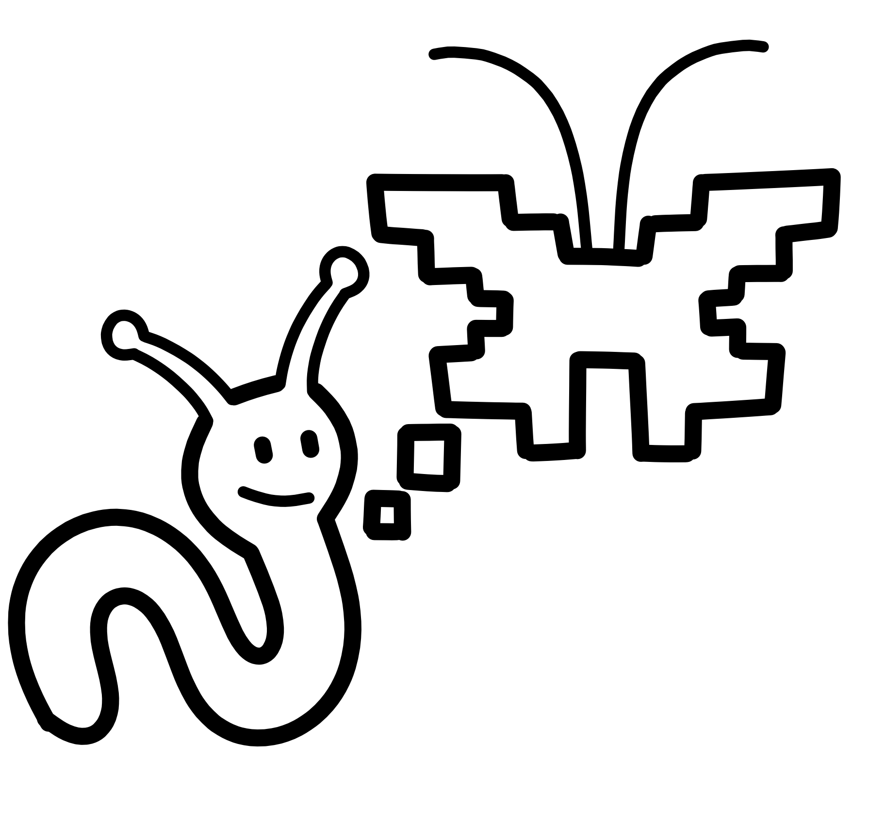

<!--
author: WiNoDa Knowledge Lab
email: winoda@gfbio.org
version: 1.0.0
language: eng
comment: Open-Science-Selbstlernkurs für objektzentrierte Forschung in LiaScript.
tags: Open Science, WiNoDa, FAIR, CARE, Open Data, Open Access, OER, LiaScript
license: CC BY 4.0
import: https://raw.githubusercontent.com/MINT-the-GAP/lia-DynFlex/main/README.md

@OS: <div class="thread os-thread"><strong>Open Science Compass:</strong> @0</div>
@WiNoDa: <div class="thread winoda-thread"><strong>WiNoDa Practical Pathway:</strong> @0</div>
@Reflection: <div class="thread reflection-thread"><strong>Reflection:</strong> @0</div>
@Check: <div class="thread check-thread"><strong>Checklist:</strong> @0</div>

@style
.thread {
  border-left: 0.35rem solid #444;
  margin: 1rem 0;
  padding: 0.75rem 1rem;
  background: #f7f8fa;
}

.os-thread {
  border-left-color: #1f6feb;
}

.winoda-thread {
  border-left-color: #1b7f4c;
}

.reflection-thread {
  border-left-color: #a15c00;
}

.check-thread {
  border-left-color: #7d4cc2;
}

.small {
  font-size: 0.92rem;
}

.source-note {
  font-size: 0.88rem;
  color: #555;
}
@end
-->

# Open Science in object-related research

Open Science self-paced LiaScript course for researchers working with object-related research data

@OS(`This course approaches Open Science as a movement, a system of values, and a set of concrete open research practices.`)

@WiNoDa(`The second pathway translates each Open Science topic into the context of natural science collections, object-related data, and the disciplinary fields represented within WiNoDa Knowledge Lab.`)

This course is aimed at researchers at doctoral level or above who work with object-related data in archaeology, biodiversity research, palaeontology, geology or related disciplines. It is a stand-alone course that you can complete at your own pace and for which no participation in other learning activities or course modules is required.

The course has been designed as a LiaScript-first open educational resource. Its source file is written in readable Markdown and can be used as an interactive course in a LiaScript viewer.

**Estimated completion time::** approx. 2–3 hours

**Course output:** By the end of the course, you will have developed a concise Open Science action plan for your own object-related research project or for an illustrative example project.

## How to use this course

1. Work through the modules in the suggested order.
2. Use the self-checks to assess your understanding.
3. For each reflection activity, briefly record your responses and key takeaways in a separate document.
4. At the end of the course, bring these notes together to create an action plan for your own research.

> Important: This course does not constitute legal advice and is not a substitute for guidance from your institution’s Open Science, research data management, ethics, or legal support services. It is designed to help you identify the right questions and prepare informed decisions.

<!-- style="display: block; width: 30%; max-width: 220px; margin: 5rem auto 0 auto;" -->

## Two guiding pathways

| Pathway | Key question | Typical artefacts |
| --- | --- | --- |
| Open Science compass | What does Open Science mean in general, and how is it put into practice? | Policies, repositories, open licences, documentation, FAIR/CARE principles, Open Access |
| WiNoDa practice pathway | What changes when research depends on collection objects, samples, specimens, or excavation contexts? | PIDs for physical objects, Open Specimen, Open Collections, site protection, provenance, Nagoya Protocol, disciplinary repositories |

<!-- style="display: block; width: 40%; max-width: 220px; margin: 6rem auto 0 auto;" -->

## Prior knowledge survey

Assess your current level of confidence. This survey is not graded.

<!-- style="direction: rtl; text-align: left" -->
- [(very high 5)(high 4)(moderate 3)(fairly low 2)(low 1)]
- [ ] I can explain Open Science in my own words
- [ ] I can distinguish between FAIR and Open
- [ ] I can select an appropriate repository for research data
- [ ] I can identify limits to openness when working with sensitive data, objects, or contexts

<!-- style="display: block; width: 25%; max-width: 220px; margin: 2rem auto 0 auto;" -->

## Course learning objectives

After completing this course, you will be able to:

- explain key principles, aims, and dimensions of Open Science
- situate Open Science practices within the research lifecycle
- explain the relationship between FAIR, CARE, and Open
- assess the role of open infrastructures, repositories, PIDs, and licences as prerequisites for reuse
- identify the specific requirements of object-related and collection-based research
- outline a well-founded Open Science strategy for your own research project or an illustrative example project

<!-- style="display: block; width: 30%; max-width: 220px; margin: 6rem auto 0 auto;" -->

## The Open Science action plan

Use this template throughout the course and complete it step by step.

| Decision | Your notes |
| --- | --- |
| Which research objects, samples, specimens, or contexts are central to the project? | |
| Which data, methods, software, and publications will be produced? | |
| What can be made openly available, what should be accessible under FAIR conditions, and what must remain closed? | |
| Which PIDs, metadata standards, vocabularies, and repositories are appropriate? | |
| Which licences and terms of use are suitable? | |
| Which ELSA, CARE, provenance, or Nagoya-related questions need to be addressed? | |
| Who can provide institutional or disciplinary support? | |

<!-- style="display: block; width: 30%; max-width: 220px; margin: 5rem auto 0 auto;" -->

---

## Module 1: Open Science basics

<!-- style="display: block; width: 30%; max-width: 220px; margin: 7rem auto 0 auto;" -->

### Learning objectives

After completing this module, you will be able to:

- describe Open Science as a global movement and as a set of open research practices
- explain the key aims of the UNESCO Recommendation on Open Science and the DFG’s position on Open Science
- identify key dimensions of Open Science
- explain why open infrastructures are essential for Open Science
- outline the relevance of Open Science for the WiNoDa Knowledge Lab and object-related research

<!-- style="display: block; width: 30%; max-width: 220px; margin: 5rem auto 0 auto;" -->

### Check-in

Which statement best reflects how Open Science is understood in this course?

- [( )] Open Science means solely making published articles freely available.
- [( )] Open Science means publishing all data without restrictions.
- [(X)] Open Science combines open accessibility, reusability, transparency, collaboration, and careful consideration of the limits to openness.
- [( )] Open Science is merely a technical issue concerning databases.

<!-- style="display: block; width: 40%; max-width: 220px; margin: 5rem auto 0 auto;" -->

### Open Science as a movement and a set of practices

Open Science has two closely connected dimensions:

1. **A global movement:** Research should become more accessible, transparent, collaborative, and responsive to society.
2. **Practices in everyday research:** Data, methods, software, publications, educational resources, and infrastructures are designed to be findable, accessible, interoperable, reusable, and transparent.

@OS(`Open Science is not an all-or-nothing principle. Instead, it follows the maxim: “As open as possible, as closed as necessary.” Good practice in Open Science means designing openness deliberately and documenting its limits with clear justification.`)

The [UNESCO Recommendation on Open Science](https://www.unesco.org/en/open-science/about) (2021) describes Open Science as an inclusive concept that brings together different movements and open research practices.

Its aims are to make scientific knowledge available, accessible, and reusable, to strengthen collaboration and the exchange of information, and to open knowledge-production processes to societal actors.

The German Research Foundation (DFG) further emphasises that Open Science should enable and improve research. Openness is therefore not an end in itself. It should support access, reproducibility, scientific progress, and research processes that are appropriate to the respective discipline.

<!--style="display: block; width: 40%; max-width: 220px; margin: 1rem auto 0 auto;" -->

### Dimensions of Open Science

| Dimension | Brief description | Example |
| --- | --- | --- |
| Open Access | Free access to and legally secured reuse of scholarly publications | Article published in an Open Access journal or made available through secondary publication |
| Open Data | Research data that are openly published or made available under controlled access conditions | Dataset with a DOI deposited in a repository |
| Open Source / Open Software | Source code is accessible, reviewable, reusable, and open to further development | Analysis code released under an MIT, GPL, or Apache licence |
| Open Methodologies | Methods, protocols, workflows, and decisions are documented in a transparent and reproducible way | Preregistration, research protocol, or electronic lab notebook |
| Open Educational Resources | Teaching and learning materials that can be freely used, adapted, and shared | This LiaScript course licensed under CC BY 4.0 |
| Open Peer Review | Transparent forms of scholarly review | Open review reports, open reviewer identities, or open participation |
| Citizen Science / Public Engagement | Participation of societal actors in research | Collection-based projects, data collection, or co-creation |

### What is the WiNoDa Knowledge Lab?

The project partners are:

- [Museum für Naturkunde Berlin (MfN)](https://www.museumfuernaturkunde.berlin/en/)
- [Deutsche Archäologische Institut (DAI)](https://www.dainst.org/en/)
- [German Federation for Biological Data (GFBio)](https://www.gfbio.org)
- [Vernetzungs- und Kompetenzstelle Open Access Brandenburg (VuK)](https://open-access-brandenburg.de/en/)
- [Gemeinsame Bibliotheksverbund (GBV)](https://en.gbv.de)
- [Zuse-Institut Berlin (ZIB)](https://www.zib.de)

WiNoDa brings together data literacy, research data management, Open Science, and public engagement. This course focuses on the Open Science perspective.
WiNoDa addresses a range of target groups, including researchers, people interested in data, collection curators, and experienced researchers.

@WiNoDa(Object-related research has a distinctive feature. Data are often derived from physical objects, samples, specimens, or excavation contexts. Open Science must therefore consider data, objects, collections, and their provenance together.)

<!-- style="display: block; width: 60%; max-width: 1200px; height: auto; margin: 7rem auto 0 auto;" -->

### Open Infrastructures

Open Science requires (open) infrastructure. This includes digital and physical systems, as well as norms, standards, governance, and sustainable maintenance.

| Infrastructure | Function in the course context |
| --- | --- |
| Repositories | Publication, archiving, and citability of data, code, preprints, or materials |
| PID systems | Unique and persistent identification of people, institutions, datasets, and objects |
| Metadata schemas | Description, discoverability, and interoperability |
| Collaboration platforms | Transparent collaboration and version control |
| Open-source tools | Reproducible processing, analysis, and documentation |
| Physical collections | Preservation, curation, and access to research objects |

<!-- style="display: block; width: 40%; max-width: 450px; height: auto; margin: 3rem auto 0 auto;" -->

### Self-check

Which elements are part of Open Science?

[[X]] Open Research Data
[[X]] Open Educational Resources
[[X]] Open Software and Source Code
[[ ]] Exclusively fee-based closed-source analysis platforms
[[X]] Open Infrastructures

<div style="height: 2.5rem;"></div>

What is a meaningful function of Open Science policies?

[( )] They completely replace disciplinary research practices.
[(X)] They provide guidance, establish support structures, and promote cultural change.
[( )] They always require the publication of all raw data.
[( )] They are only relevant to libraries.

<!-- style="display: block; width: 35%; max-width: 450px; height: auto; margin: 3rem auto 0 auto;" -->

<div style="height: 2.5rem;"></div>

@Reflection(`Write down two Open Science practices that are already part of your everyday research. Also write down one practice that you would like to implement more systematically.`)

<div style="height: 3rem;"></div>

### Key Takeaway

Open Science is both a framework of values and a framework for practice. For WiNoDa, it is important that openness does not apply only to publications or datasets, but to the entire research cycle and the material foundations of object-related research.

<!-- style="display: block; width: 40%; max-width: 450px; height: auto; margin: 3rem auto 3rem auto;" -->

### Sources for Module 1

- UNESCO. (2021). *UNESCO recommendation on Open Science*. https://doi.org/10.54677/MNMH8546

- Deutsche Forschungsgemeinschaft. (2022). *Open Science as part of research culture: Positioning of the German Research Foundation*. https://doi.org/10.5281/zenodo.7194537

- Fecher, B., & Friesike, S. (2014). Open Science: One term, five schools of thought. In S. Bartling & S. Friesike (Eds.), *Opening science: The evolving guide on how the Internet is changing research, collaboration and scholarly publishing* (pp. 17–47). Springer. https://doi.org/10.1007/978-3-319-00026-8_2

#### Internal materials

*KernkursOpenScience_Modulplanung_v3.docx*. (n.d.). [Unpublished internal course-planning document].

*Quo_Vadis_WiNoDa_11_02_25.pdf*. (n.d.). [Unpublished internal project document].

*Praesentation_v6_2025-05-13.pdf*. (2025). [Unpublished internal presentation].

*WinterSchool_Presentation_v3*. (n.d.). [Unpublished internal presentation].

## Module 2: Open science in research

<!-- style="display: block; width: 35%; max-width: 450px; height: auto; margin: 4rem auto 0 auto;" -->

### Learning objectives

After completing this module, you will be able to:

- locate Open Science practices within the research lifecycle
- explain documentation, preregistration, and open methodologies
- assess open formats and open-source software as building blocks for reuse
- explain Linked Open Data and the five-star model for open data
- identify the specific features of Open Specimen and Open Collections in object-related research

<!-- style="display: block; width: 30%; max-width: 220px; height: auto; margin: 5rem auto 0 auto;" -->

### Check-in

When does Open Science begin in a research project?

[( )] Only after the article has been accepted.
[( )] Only once a repository has been selected.
[(X)] During the planning phase, because decisions about documentation, rights, formats, objects, and repositories need to be made early.
[( )] Only during public engagement activities.

<!-- style="display: block; width: 40%; max-width: 220px; height: auto; margin: 5rem auto 0 auto;" -->
### Open science in the research lifecycle

```ascii
                    +------------------+
                    | Planning         |
                    | questions, DMP,  |
                    | rights, CARE     |
                    +--------+---------+
                             |
                             v
+------------------+   +-----+------------+   +------------------+
| Reuse            |<--| Data collection  |-->| Processing       |
| cite,            |   | document,        |   | clean,           |
| assess           |   | version          |   | validate         |
+--------+---------+   +--------+---------+   +--------+---------+
         ^                      |                      |
         |                      v                      v
+--------+---------+   +--------+---------+   +--------+---------+
| Publication      |<--| Analysis         |<--| Description      |
| data, code,      |   | code, tools,     |   | metadata, PIDs,  |
| articles         |   | workflows        |   | licences         |
+------------------+   +------------------+   +------------------+
```

@OS(`The research lifecycle shows that openness is not the final step. Decisions about documentation, formats, rights, and infrastructure have an impact from the very beginning.`)

### Documentation as a core practice

Without transparent and comprehensible documentation, reuse and reproducibility are hardly possible. Documentation involves more than a methods section in an article:

- context of data collection and selection decisions
- objects, samples, specimens, or excavation contexts used
- instruments, software, versions, and parameters
- data cleaning and exclusion decisions
- folder structure, file formats, variables, and units
- rights, licences, access restrictions, and provenance
- deviations from the original plan

@WiNoDa(`In object-related research, documentation must preserve the relationship between the physical object and the data derived from it. Without stable object identification, a dataset loses much of its potential for reuse.`)

<!-- style="display: block; width: 35%; max-width: 450px; height: auto; margin: 4rem auto 0 auto;" -->

### Open methodologies and preregistration

Open methodologies refers to practices that make the research process transparent. These include:

- preregistration of research questions, hypotheses, methods, or analysis plans
- open protocols and workflows
- versioning of code, data processing, and documentation
- publication of methods, scripts, and interim results where appropriate
- open formats and standards

Preregistration is not only relevant to conventional hypothesis-testing studies. In archaeology, palaeontology, biodiversity research, or geology, it can help make project planning, data collection strategies, and later deviations transparent. Planning is particularly important for excavations or invasive analyses of objects because data collection cannot always be repeated.

<!-- style="display: block; width: 35%; max-width: 450px; height: auto; margin: 4rem auto 0 auto;" -->

### Open formats

Open formats are documented, standardised, and not tied to a particular vendor. They reduce dependencies and improve long-term usability.

| Data type | Common open or preservation-friendly formats | Use caution with |
| --- | --- | --- |
| Tables | CSV, TSV, ODS | proprietary spreadsheets with hidden formulas |
| Text | TXT, Markdown, XML, PDF/A | unstructured scans without OCR |
| Images | TIFF, PNG, JPEG 2000 | compressed working copies as the only available version |
| Geospatial data | GeoJSON, GeoPackage, GeoTIFF, Shapefile with documentation | incomplete project data from desktop GIS software |
| 3D data / models | OBJ, PLY, STL, or glTF, depending on purpose | undocumented specialised formats |
| Code | plain text, scripts, container files, and environment files | graphical workflows without an export option |

### Open-source software

Open-source software means that source code is openly available and can be used, reviewed, modified, and shared under a software licence. Creative Commons licences are generally not suitable for research software. Common software licences include MIT, GPL, LGPL, Apache, BSD, MPL, and EPL.

Open source supports:

- transparency of analytical processes
- reproducibility of results
- further development by communities
- data sovereignty and reduced vendor lock-in
- longer-term availability of scientific workflows

<!-- style="display: block; width: 35%; max-width: 450px; height: auto; margin: 4rem auto 0 auto;" -->

### Linked open data and interoperability

Interoperability means that data can be exchanged, interpreted, and combined across different systems. This requires machine-readable data, metadata, PIDs, vocabularies, ontologies, and standardised relationships.

The [five-star deployment scheme for Open Data](https://5stardata.info/en/), developed by Tim Berners-Lee, provides a useful framework:

| Level | Requirement | Example |
| --- | --- | --- |
| 1 star | available on the web and openly licensed | PDF or image file |
| 2 stars | machine-readable and structured | spreadsheet format |
| 3 stars | non-proprietary format | CSV instead of XLSX |
| 4 stars | open W3C standards such as RDF and SPARQL | RDF graph |
| 5 stars | linked to other data | Linked Open Data |

@Check(`More stars do not automatically mean better research. They often also require more effort. What matters is which forms of reuse are realistic and appropriate for the respective discipline.`)

### Open specimen and open collections

In collection-based research, physical objects are not merely research materials but primary sources of evidence. Data derived from them can never replace all the characteristics of the original object.

Key principles include:

- objects, samples, or specimens should be findable and accessible over the long term wherever possible
- PIDs such as IGSNs, CETAF Stable Identifiers, or NSIds can be used to reference physical objects
- at a minimum, stable catalogue numbers and collection information should be available
- collections require inventory management, cataloguing, digitisation, curation, and sustainable governance
- Open Collections does not mean that every object must be freely available for physical access; rather, information and access pathways should be transparent and designed according to the FAIR principles

<!-- style="display: block; width: 35%; max-width: 450px; height: auto; margin: 4rem auto 0 auto;" -->

### Self-check

<section class="dynFlex" data-gap="40" data-basis="50" data-store="module-2-self-check">

<div class="flex-child">

#### Documentation

Which statement about documentation is correct?

[( )] Documentation only becomes relevant after publication.

[(X)] Documentation enables transparency, reuse, and the assessment of research results.

[( )] Documentation completely replaces metadata.

[( )] Documentation only applies to textual data.

</div>

<div class="flex-child">

#### Persistent identifiers

Which PID is the best fit?

Published dataset:  
[[(DOI)|ORCID|ROR|IGSN/CSI/NSId]]

Researcher:  
[[DOI|(ORCID)|ROR|IGSN/CSI/NSId]]

Research institution:  
[[DOI|ORCID|(ROR)|IGSN/CSI/NSId]]

Physical sample or specimen:  
[[DOI|ORCID|ROR|(IGSN/CSI/NSId)]]

</div>

</section>

<div style="height: 3rem;"></div>

#### Interoperability

Which practices improve interoperability?

[[X]] Using controlled vocabularies

[[X]] Using persistent identifiers

[[X]] Providing structured metadata

[[ ]] Providing data only as screenshots

[[X]] Using open and documented file formats

<div style="height: 3rem;"></div>

### Reflection

@Reflection(`Choose a data type from your own research. Note which open format, documentation, PID, and repository might be suitable for it.`)

<!-- style="display: block; width: 35%; max-width: 450px; height: auto; margin: 7rem auto 3rem auto;" -->

### Key takeaway

Open Science in research means designing the research process so that other people and machines can understand how data, methods, and results were produced. In object-related research, the relationship between data, objects, collections, and provenance must also remain stable.

<!-- style="display: block; width: 35%; max-width: 450px; height: auto; margin: 7rem auto 3rem auto;" -->

### Sources for module 2

Berners-Lee, T. (2006, July 27). *Linked data*. World Wide Web Consortium. https://www.w3.org/DesignIssues/LinkedData.html

Colella, J. P., Stephens, R. B., Campbell, M. L., Kohli, B. A., Parsons, D. J., & McLean, B. S. (2021). The open-specimen movement. *BioScience, 71*(4), 405–414. https://doi.org/10.1093/biosci/biaa146

GO FAIR. (n.d.). *FAIR principles*. Retrieved July 17, 2026, from https://www.go-fair.org/fair-principles/

Open Source Initiative. (n.d.). *OSI approved licenses*. Retrieved July 17, 2026, from https://opensource.org/licenses

Ross, S. A., & Ballsun-Stanton, B. (2021). *Introducing preregistration of research design to archaeology* [Preprint]. SocArXiv. https://doi.org/10.31235/osf.io/sbwcq

Tennant, J. P., & Farke, A. A. (2019). *Open science in dinosaur paleontology* [Preprint]. PaleorXiv. https://doi.org/10.31233/osf.io/wzfpb

#### Internal materials

*KernkursOpenScience_Modulplanung_v3*. (n.d.). [Unpublished internal course-planning document].

*Praesentation_v6_2025-05-13*. (2025). [Unpublished internal presentation].

*Presentation_Webinar_Be-Fair-and-Care_2025-05-20*. (2025). [Unpublished internal presentation].

*WinterSchool_Presentation_v3*. (n.d.). [Unpublished internal presentation].

---

## Module 3: Open science in publishing

<!-- style="display: block; width: 35%; max-width: 450px; height: auto; margin: 4rem auto 3rem auto;" -->

### Learning objectives

After completing this module, you will be able to:

- distinguish between different forms of data publication
- apply criteria for selecting a repository
- explain Open Access, licences, and data and code availability statements
- describe the purpose and structure of data papers
- assess Open Peer Review and its opportunities and limitations

<!-- style="display: block; width: 30%; max-width: 220px; height: auto; margin: 5rem auto 0 auto;" -->

### Check-in

What is a common disadvantage of publishing research data only as a supplement to an article?

[( )] Supplements are always more open than repositories.
[(X)] The dataset often does not receive its own PID and is more difficult to cite independently.
[( )] Supplements must always be published under CC0.
[( )] Supplements automatically contain all raw data.

<!-- style="display: block; width: 40%; max-width: 220px; height: auto; margin: 5rem auto 0 auto;" -->

### Three approaches to data publication

| Form | Benefits | Limitations |
| --- | --- | --- |
| Repository | dedicated DOI or PID, metadata, licence, and more sustainable discoverability | selecting a repository and preparing the data take time |
| Data journal | the dataset is contextualised and described through peer review | the data are usually also deposited in a repository |
| Supplement to an article | often meets journal requirements and links the data to the article | frequently contains limited raw data, offers weaker citability, and supports less reuse |

@OS(`Good data publication does more than make data visible. It also makes them citable, legally reusable, and interpretable within their disciplinary context.`)

### Selecting repositories

A suitable repository should match the discipline, data type, access requirements, and long-term perspective.

Criteria include:

- suitable for the discipline or subject area
- accepts the relevant data type and file sizes
- assigns PIDs, ideally DOIs or discipline-specific identifiers
- supports licences and clear terms of use
- offers embargoes or restricted access where necessary
- provides quality assurance or data curation
- operates transparently and is designed for long-term use
- is certified or complies with recognised standards where possible

Snapshot: On 24 June 2026, re3data.org listed **3,505 repositories**. The service recommends the following citation: re3data.org – Registry of Research Data Repositories, DOI: [10.17616/R3D](https://doi.org/10.17616/R3D), last accessed: 24 June 2026.

@Check(`Start by looking for a discipline-specific repository. If no suitable disciplinary repository is available, consider institutional or general-purpose services such as Zenodo, OSF, or Figshare.`)

### Repositories in the WiNoDa context

| Context | Possible starting points |
| --- | --- |
| Earth and environmental sciences | PANGAEA and discipline-specific repositories listed in re3data |
| Biodiversity | GFBio, GBIF-related data publication, and disciplinary repositories |
| Archaeology | IANUS, Journal of Open Archaeology Data, Internet Archaeology, and disciplinary repositories |
| Cross-disciplinary data | Zenodo, OSF, Figshare, or institutional repositories |
| Code | GitHub or GitLab combined with archiving and a DOI, for example through Zenodo |

### Data papers

Data papers do not interpret data in the same way as research articles. Instead, they describe datasets so that others can find, assess, cite, and reuse them.

Typical components include:

- title, authors, abstract, and keywords
- context and purpose of data collection
- methods used for data collection and processing
- description of the data structure, files, variables, units, and formats
- quality control, validation, and limitations
- rights, licences, and access restrictions
- links to publications, code, objects, collections, or other datasets
- data and code availability statements

@WiNoDa(`For object-related data, data papers should explicitly document relationships to physical objects, sites, collections, catalogue numbers, or object PIDs.`)

### Open Access

Open Access refers to free access to scholarly publications and legally secured reuse. Two established routes are:

- **Green Open Access:** secondary publication, usually through a repository
- **Gold Open Access:** first publication in an Open Access journal, sometimes involving article processing charges

**Diamond Open Access** is an important form of Open Access in which publications are openly accessible without fees for readers or authors.

For data and data papers, Open Access is closely connected to licences, repositories, and the FAIR principles. Accessibility alone is not enough: users also need to know what they are permitted to do.

### Licences

Licences make usage rights explicit. Without a clear licence, reuse remains legally uncertain.

| Material | Commonly suitable licences | Note |
| --- | --- | --- |
| Research data | CC0, CC BY | CC0 maximises reuse; CC BY requires attribution |
| Texts and OER | CC BY, CC BY-SA | NC and ND conditions can restrict reuse |
| Software | MIT, GPL, LGPL, Apache, BSD, MPL | Creative Commons licences should not be used for software code |
| Sensitive data | potentially no open licence, but controlled access instead | metadata should still be as open as possible |

### Open peer review

Open Peer Review is an umbrella term for review practices in which parts of the peer-review process are made visible.

| Form | What is opened? | Potential benefit |
| --- | --- | --- |
| Open identities | the names of reviewers and/or authors are disclosed | accountability and recognition |
| Open reports | review reports are published | transparency, citability, and educational value |
| Open participation | a broader community can comment | additional perspectives and open discussion |

Limitations: Power relations, bias, and self-censorship may shift rather than disappear. The suitability of Open Peer Review also depends on the discipline, career stage, and publication culture.

### Case study: Göbekli Tepe

WiNoDa presentations use a dataset on Göbekli Tepe as an example for searching and assessment:

Lourentzaki, A., Papadopoulou, M., & Roche, C. (2024). *Modeling An Archaeological Site - Göbekli Tepe v.1.0* [Data set]. Zenodo. https://doi.org/10.5281/zenodo.13370343

Possible assessment questions:

- Is the provenance of the dataset documented sufficiently?
- Which software was used, and is it openly licensed?
- Does the licence permit modification and redistribution?
- Are there links to publications, objects, sites, or other datasets?
- Is the dataset sufficiently FAIR for your specific purpose?

### Self-check

Which criteria indicate that a repository is suitable?

[[X]] It matches the discipline and data type.
[[X]] It assigns a PID.
[[X]] It supports clear licences.
[[ ]] It always requires all data to be made public without exception.
[[X]] It provides transparent terms of use.

<div style="height: 2.5rem;"></div>

Which licence maximises the potential reuse of research data?

[(X)] CC0
[( )] CC BY-NC-ND
[( )] All rights reserved
[( )] No licence information

<div style="height: 2.5rem;"></div>

Which statement about data papers is correct?

[( )] A data paper always replaces publication in a repository.
[(X)] A data paper describes and contextualises datasets that are usually deposited separately in a repository.
[( )] A data paper must not include information about methods.
[( )] A data paper is only suitable for textual data.

### Reflection

@Reflection(`Choose a publication route for your example dataset. Briefly explain your choice: repository, data paper, supplement, or a combination? Which licence would you suggest, and why?`)

### Key takeaway

Open Science in publishing means publishing results, data, code, and contextual information in ways that allow others to find, assess, cite, and reuse them. In object-related research, publication must make the relationships between data, objects, collections, and rights visible.

### Sources for module 3

Budapest Open Access Initiative. (2002, February 14). *Budapest Open Access Initiative*. https://www.budapestopenaccessinitiative.org/read/

Creative Commons. (n.d.). *About CC licenses*. https://creativecommons.org/share-your-work/cclicenses/

GBIF. (n.d.). *Data papers*. Retrieved July 17, 2026, from https://www.gbif.org/data-papers

Journal of Open Archaeology Data. (n.d.). *About*. Retrieved July 17, 2026, from https://openarchaeologydata.metajnl.com/about

Lourentzaki, A., Papadopoulou, M., & Roche, C. (2024). *Modeling an archaeological site—Göbekli Tepe v.1.0* [Data set]. Zenodo. https://doi.org/10.5281/zenodo.13370343

Max Planck Society. (2003, October 22). *Berlin Declaration on Open Access to Knowledge in the Sciences and Humanities*. https://openaccess.mpg.de/Berlin-Declaration

National Information Standards Organization. (2022). *Contributor Role Taxonomy (CRediT)*. https://credit.niso.org/

re3data.org. (n.d.). *Registry of Research Data Repositories*. Retrieved July 17, 2026, from https://doi.org/10.17616/R3D

#### Internal materials

*KernkursOpenScience_Modulplanung_v3*. (n.d.). [Unpublished internal course-planning document].

*Praesentation_v6_2025-05-13*. (2025). [Unpublished internal presentation].

*WinterSchool_Presentation_v3*. (n.d.). [Unpublished internal presentation].

---

## Module 4: Reflecting on open science

### Learning objectives

After completing this module, you will be able to:

- distinguish between FAIR, CARE, and Open and explain how they relate to one another
- identify ethical, legal, and social limits to openness
- assess risks associated with sensitive object, site, provenance, or personal data
- reflect on research assessment and incentive systems as conditions shaping Open Science
- develop realistic strategies for implementing Open Science in your own context

### Check-in

Which statement is correct?

[( )] FAIR always means completely open.
[(X)] FAIR means that data are findable, accessible, interoperable, and reusable; access may still be restricted under certain conditions.
[( )] CARE completely replaces FAIR.
[( )] Open Science prohibits access restrictions.

### FAIR, Open, and CARE

FAIR and Open overlap, but they are not the same.

| Concept | Focus | Guiding question |
| --- | --- | --- |
| FAIR | technical and organisational reusability | Can people and machines find, understand, access, and reuse the data? |
| Open | reducing access, legal, and technical barriers | Who can use and share scholarly knowledge? |
| CARE | rights, interests, power relations, and benefits for communities | Who benefits, who decides, and who may be harmed? |

@OS(`A useful guiding principle is: as open as possible, as closed as necessary, but always as transparent as responsibly possible.`)

### CARE principles

The CARE Principles for Indigenous Data Governance were developed by the Global Indigenous Data Alliance. They complement FAIR by adding a people- and community-centred perspective.

| Principle | Meaning |
| --- | --- |
| Collective Benefit | data and data ecosystems should benefit the communities concerned |
| Authority to Control | rights and decision-making authority over data are recognised |
| Responsibility | researchers are accountable and support capacity building |
| Ethics | rights, well-being, and the prevention of harm are central |

CARE is not only relevant when working explicitly with Indigenous data. The underlying questions are also useful for sensitive data from colonial contexts, collection provenance, socially vulnerable groups, or cultural heritage.

### Limits to openness

Not everything can or should be made fully open. Limits may arise from:

- data protection and privacy rights
- copyright, related rights, and contracts
- protection of archaeological sites
- protection of endangered species or sensitive habitats
- dual-use risks
- colonial provenance, National Socialist contexts, or unclear ownership histories
- Indigenous data, cultural heritage, and community rights
- the Nagoya Protocol and access and benefit-sharing for genetic resources
- security, embargo, or quality-related considerations

@WiNoDa(`Object-related research often requires graduated levels of openness: metadata may be open, precise site information restricted, access to objects regulated, and community or collection perspectives documented.`)

### Decision matrix: Responsible openness

| Question | If yes | Possible measure |
| --- | --- | --- |
| Can individuals be identified? | data-protection risk | anonymisation, aggregation, or controlled access |
| Are sites or species at risk? | protection risk | generalise coordinates, apply an embargo, or review access |
| Are Indigenous or vulnerable communities involved? | CARE relevance | consultation, governance, consent, and shared rules for use |
| Is the provenance problematic or unclear? | ethical and legal risk | document origins, seek advice, and explain restrictions |
| Do third parties hold contractual rights? | legal risk | clarify rights, adjust the licence, or separate the data |
| Could the data be misused? | dual-use risk | conduct a risk assessment, restrict access, or publish metadata only |

### Research assessment and incentive systems

Open Science does not take place in a vacuum. Researchers work within systems that reward publications, external funding, metrics, and visibility. These systems can support or hinder Open Science.

Common tensions include:

- Documentation and data curation require time but are not always rewarded.
- Data papers, software, OER, and peer review are not recognised everywhere as equivalent research outputs.
- APCs and publication fees create inequalities.
- Competitive systems can make sharing more difficult.
- Metrics can distort behaviour, for example through *publish or perish* pressures.

Initiatives such as DORA and CoARA advocate broader and more responsible approaches to research assessment. For Open Science, it is essential that data, software, collection work, curation, OER, and transparent review are visible and recognised.

### Self-check

Which statements are correct?

[[X]] FAIR data do not automatically have to be open.
[[X]] CARE complements FAIR by addressing the rights, interests, and power relations of affected communities.
[[ ]] Open Science always requires the publication of exact site locations.
[[X]] Metadata can remain open even when access to the data is restricted.
[[X]] Research assessment influences which Open Science practices can realistically be implemented.

<div style="height: 2.5rem;"></div>

Match the concepts:

Machine- and human-readable reusability: [[(FAIR)|Open|CARE]]

Reducing access and legal barriers: [[FAIR|(Open)|CARE]]

Community rights, benefits, and responsibility: [[FAIR|Open|(CARE)]]

### Reflection

@Reflection(`Choose one potentially sensitive type of information from your example project. Decide whether it should be published openly, made available under restricted access, or not published. Justify your decision using FAIR, Open, and CARE.`)

### Key takeaway

Open Science requires reflection. Good openness is not maximal; it is justified, documented, and responsible. In object-related research in particular, data quality, rights, provenance, collection practices, and social responsibility must be considered together.

### Sources for module 4

Carroll, S. R., Garba, I., Figueroa-Rodríguez, O. L., Holbrook, J., Lovett, R., Materechera, S., Parsons, M., Raseroka, K., Rodriguez-Lonebear, D., Rowe, R., Sara, R., Walker, J. D., Anderson, J., & Hudson, M. (2020). The CARE principles for Indigenous data governance. *Data Science Journal, 19*(1), Article 43. https://doi.org/10.5334/dsj-2020-043

Coalition for Advancing Research Assessment. (2022). *Agreement on reforming research assessment*. https://coara.eu/agreement/the-agreement-full-text/

DORA. (2012, December 16). *San Francisco Declaration on Research Assessment*. https://sfdora.org/read/

Frank, R. D., Kriesberg, A., Yakel, E., & Faniel, I. M. (2015). Looting hoards of gold and poaching spotted owls: Data confidentiality among archaeologists and zoologists. *Proceedings of the Association for Information Science and Technology, 52*(1), 1–10. https://doi.org/10.1002/pra2.2015.145052010037

Global Indigenous Data Alliance. (n.d.). *CARE principles for Indigenous data governance*. Retrieved July 17, 2026, from https://www.gida-global.org/careprinciples

Leibniz Institute DSMZ–German Collection of Microorganisms and Cell Cultures. (n.d.). *ABS Science HuB*. Retrieved July 17, 2026, from https://nagoyaprotocol-hub.de/

#### Internal materials

*KernkursOpenScience_Modulplanung_v3*. (n.d.). [Unpublished internal course-planning document].

*Presentation_Webinar_Be-Fair-and-Care_2025-05-20*. (2025). [Unpublished internal presentation].

*WinterSchool_Presentation_v3*. (n.d.). [Unpublished internal presentation].

---

## Course conclusion: Your open science action plan

### Scenario

You are planning a research project involving object-related data. You may use data from your own project or the following example:

> An interdisciplinary team is studying digitised 3D models, image data, and measurement data from a natural history collection. The objects have catalogue numbers, partly unclear provenance, and some sensitive location information. The project produces tables, image data, analysis code, a publication, and a dataset.

### Task

Create an action plan containing seven decisions.

@Check(`1. Identify the research objects and data types. 2. Define the level of openness for each artefact. 3. Plan documentation and metadata. 4. Secure PIDs and relationships between objects. 5. Select formats and software. 6. Choose a repository and licence. 7. Address ELSA, CARE, provenance, and Nagoya-related questions.`)

Use the table from the beginning of the course or this condensed version:

| Step | Decision |
| --- | --- |
| Artefacts | Which data, objects, methods, software, and publications will be produced? |
| Openness | What will be published openly, made available under restricted access, or not published? |
| FAIR | How will the data be made findable, accessible, interoperable, and reusable? |
| WiNoDa context | How will the object, collection, PID, provenance, and dataset remain connected? |
| Publication | Which repository, licence, and availability statements will be used? |
| Responsibility | Which CARE, ELSA, Nagoya, or protection-related questions need to be addressed? |
| Support | Which services, policies, or contact persons can provide assistance? |

### Final self-check

Which statement best describes a good Open Science decision?

[( )] It maximises openness regardless of context and risks.
[( )] It avoids openness as soon as a question becomes complicated.
[(X)] It combines openness, FAIR reusability, CARE responsibility, and disciplinary practicality.
[( )] It postpones decisions about documentation and rights until after the project has ended.

### Next steps

- Review institutional policies on Open Science, Open Access, and research data.
- Identify the relevant support services for Open Access, research data management, data protection, ethics, legal matters, and collections.
- Use disciplinary support services at your institution where needed or, for questions specifically related to WiNoDa, contact winoda\@gfbio.org.
- Update your action plan no later than the proposal, data-collection, submission, and publication stages.

## Sources and local source materials

This course is based on the materials provided in the project folder:

- `KernkursOpenScience_Modulplanung_v3.docx`
- `Praesentation_v6_2025-05-13.pdf`
- `Presentation_Webinar_Be-Fair-and-Care_2025-05-20.pdf`
- `WinterSchool_Presentation_v3.pdf`
- `Quo_Vadis_WiNoDa_11_02_25.pdf`
- `Kaden_Kobialka_Hantow_HandsOnWorkshop_BiblioCon2026.pdf`
- `OSF_DataLifecycleOSPractices.webp` was not used as a central course image because of visible artefacts.

Additional open references:

- LiaScript. Documentation and Exporter. https://liascript.github.io/ and https://www.npmjs.com/package/@liascript/exporter
- UNESCO. Recommendation on Open Science. https://unesdoc.unesco.org/ark:/48223/pf0000379949
- Deutsche Forschungsgemeinschaft. Open Science as Part of Research Culture. https://doi.org/10.5281/zenodo.7194537
- GO FAIR. FAIR Principles. https://www.go-fair.org/fair-principles/
- Global Indigenous Data Alliance. CARE Principles. https://www.gida-global.org/care
- re3data.org. Registry of Research Data Repositories. https://doi.org/10.17616/R3D
- Creative Commons. About CC Licenses. https://creativecommons.org/share-your-work/cclicenses/
- Open Source Initiative. Licenses. https://opensource.org/licenses
- Budapest Open Access Initiative. https://www.budapestopenaccessinitiative.org/read/
- Berlin Declaration on Open Access. https://openaccess.mpg.de/Berlin-Declaration
- DORA. https://sfdora.org/read/
- CoARA. https://coara.eu/

## Licence notice

Unless otherwise indicated, this course draft is licensed under **CC BY 4.0**. Before publication, every embedded graphic, screenshot, and item of third-party material must be reviewed individually for its licence, attribution requirements, and permission for adaptation.

## Export note

The course source is written as LiaScript-compatible Markdown. A local SCORM or web export was not configured because `node`, `npm`, `npx`, and `liaex` were not installed in the current environment. Once the LiaScript Exporter has been installed, the file can be prepared for use in learning-management systems.